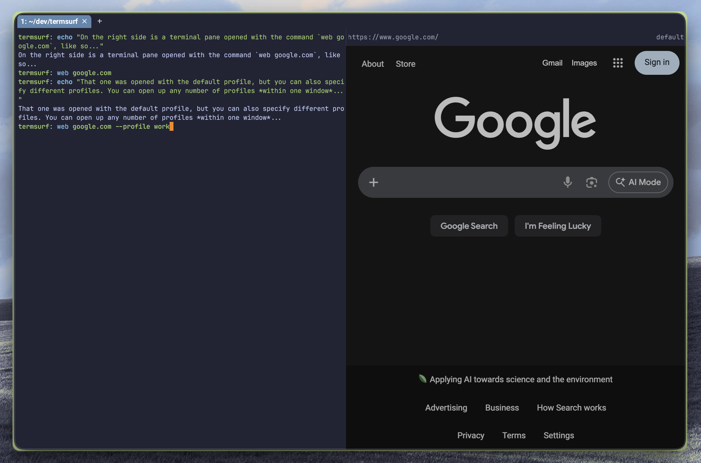

# TermSurf

**A terminal that browses.**

Type `web` and a full Chromium browser opens right in your terminal pane. No
window switching. No context loss. Just web.

```bash
web google.com
```



## Why TermSurf?

You're deep in a terminal session. You need to check docs, hit an API, or log
into a dashboard. The traditional workflow: Cmd+Tab to browser, lose your place,
Cmd+Tab back. Repeat dozens of times a day.

TermSurf eliminates the context switch. Browser panes live alongside terminal
panes in the same window. You stay in flow.

## Profiles

Like Chrome, TermSurf supports isolated browser profiles. Each profile has its
own cookies, storage, and login sessions.

```bash
web google.com                      # Default profile
web --profile work slack.com        # Work profile (separate login)
web --profile personal github.com   # Personal profile (different account)
```

Run all three in the same terminal window. Each profile is completely isolated —
logging into Google in one profile doesn't affect the others.

## Features

- **Full Chromium** — Not a simplified renderer. Real DevTools, real JavaScript,
  real web.
- **Profile isolation** — Separate cookies, sessions, and storage per profile.
- **60fps rendering** — Hardware-accelerated via Metal/wgpu.
- **Keyboard modes** — Browse mode for the web, Control mode for terminal
  keybindings.
- **Mouse support** — Click, scroll, select, drag. It's a real browser.

## Getting Started

### Prerequisites (macOS)

```bash
curl --proto '=https' --tlsv1.2 -sSf https://sh.rustup.rs | sh
brew install cmake ninja
```

### Build & Run

```bash
cd ts3 && ./scripts/build-debug.sh --open
```

First build downloads CEF (~300MB). Then in the terminal:

```bash
web google.com
```

## Keyboard Modes

TermSurf webviews have two modes:

| Mode        | Behavior                                     |
| ----------- | -------------------------------------------- |
| **Browse**  | Keyboard/mouse goes to the browser (default) |
| **Control** | Browser dimmed, terminal keybindings active  |

| Key              | Action                 |
| ---------------- | ---------------------- |
| Ctrl+C (Browse)  | Switch to Control mode |
| Enter (Control)  | Switch to Browse mode  |
| Ctrl+C (Control) | Close webview          |
| Cmd+C (Control)  | Copy URL to clipboard  |

### Navigation

| Key         | Action      |
| ----------- | ----------- |
| Cmd+[       | Back        |
| Cmd+]       | Forward     |
| Cmd+R       | Reload      |
| Cmd+Shift+R | Hard reload |

## Status

TermSurf is in active development. Core browsing works — rendering, input,
profiles, navigation. DevTools and some polish features are still in progress.

macOS only for now. Linux and Windows support is planned.

## Contributing

See [CLAUDE.md](./CLAUDE.md) for architecture details, build instructions, and
the full development guide.

## License

See individual component licenses in `ts1/`, `ts2/`, `ts3/`, and `cef-rs/`.
