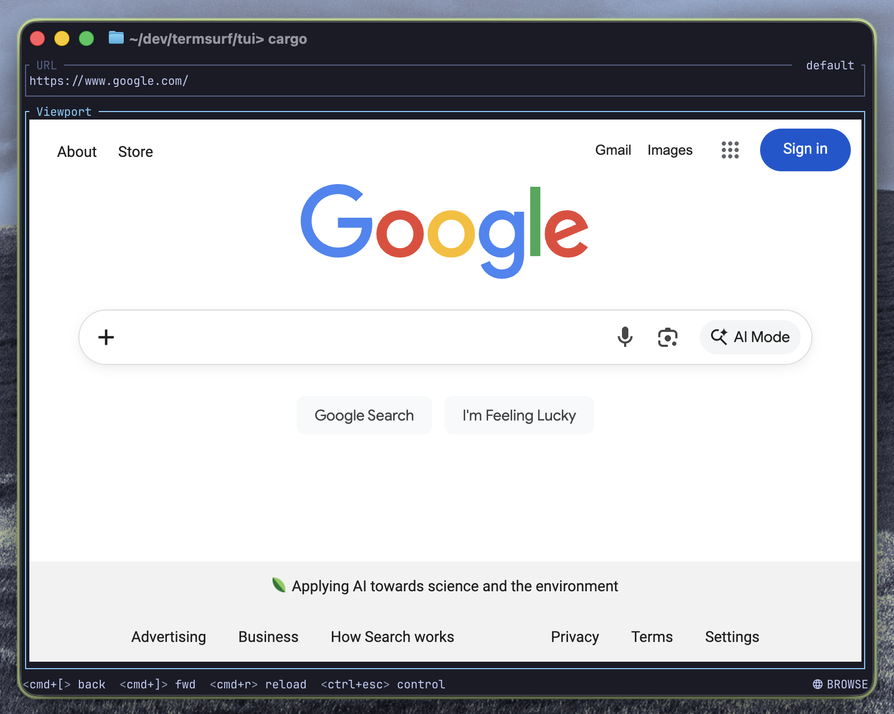

# TermSurf

**A terminal that surfs.**

Type `web` and a full web browser opens right in your terminal pane. No window
switching. No context loss. Just web.

```bash
web google.com
```



## Why TermSurf?

You're deep in a terminal session. You need to check docs, hit an API, or log
into a dashboard. The traditional workflow: Cmd+Tab to browser, lose your place,
Cmd+Tab back. Repeat dozens of times a day.

TermSurf eliminates the context switch. Browser panes live alongside terminal
panes in the same window. You stay in flow.

## Features

### Browser Integration

- **Full Chromium** — Not a simplified renderer. Real DevTools, real JavaScript,
  real web. Embedded via the Content API (not CEF).
- **Zero-copy compositing** — CALayerHost lets Window Server composite directly
  from GPU VRAM. No per-frame IPC, no texture copies.
- **60fps Metal rendering** — Hardware-accelerated at Retina resolution.
- **Dynamic resize** — Browser pane resizes with window and splits.
- **Multi-pane** — Multiple browser panes in one window.
- **Profile isolation** — Separate cookies, sessions, and storage per profile.
- **Dark mode** — System color scheme forwarded to Chromium. Override with
  `:colorscheme dark|light|system`.
- **Chrome DevTools** — Open in a split pane with
  `:devtools right|left|up|down`.

### Mouse Input

- Click, drag, and scroll forwarded to browser
- Cursor changes (pointer, text, crosshair, etc.)
- Text selection
- Click-to-focus — clicking an unfocused pane activates it without passing the
  click through (macOS-style)

### Keyboard Input

- Full keyboard forwarding to Chromium in browse mode
- Cmd+key bypass — Cmd+C/V/A/X/Z go to browser, not terminal
- Clipboard integration

### Navigation

- URL bar with vim-style editing (edtui widget)
- Smart URL resolution — `web google.com`, `web ./file.html`, `web :3000`,
  `web devtools` all resolve correctly
- URL normalization — bare domains get `https://` prefix automatically
- `file://` support — `web file <path>` or `web ./path`
- Browser navigation: Cmd+[ (back), Cmd+] (forward), Cmd+R (reload)
- Loading progress indicator
- Page title display in viewport border
- Links open in same tab (no popups)
- Configurable homepage — `web` without args opens default page

### Vim-Style Modes

| Mode        | Behavior                                          |
| ----------- | ------------------------------------------------- |
| **Control** | Terminal keybindings active (default on startup)  |
| **Browse**  | Keyboard/mouse goes to the browser                |
| **Edit**    | Vim-style URL editing with Normal/Insert submodes |
| **Command** | `:` prefix for commands                           |

| Key    | Mode    | Action                      |
| ------ | ------- | --------------------------- |
| Esc    | Browse  | Switch to Control           |
| Enter  | Control | Switch to Browse            |
| i      | Control | Edit URL (insert at cursor) |
| A      | Control | Edit URL (insert at end)    |
| I      | Control | Edit URL (insert at start)  |
| n      | Control | Edit URL (normal mode)      |
| v      | Control | Edit URL (visual mode)      |
| V      | Control | Edit URL (visual line)      |
| :      | Control | Enter Command mode          |
| q      | Control | Quit                        |
| Ctrl+C | Any     | Force quit                  |

Context-sensitive Esc exits the current mode appropriately. Per-mode color
indicators follow the LazyVim Tokyo Night palette.

### Commands

| Command                            | Action                      |
| ---------------------------------- | --------------------------- |
| `:q` / `:quit`                     | Quit                        |
| `:qa` / `:quitall`                 | Quit all panes              |
| `:devtools [direction]`            | Open DevTools in split pane |
| `:colorscheme dark\|light\|system` | Set color scheme            |

Vim-style subsequence matching — `:cs dark` works for `:colorscheme dark`.

### UI

- Active pane indicator with colored borders and background desaturation
- Inner padding so borders don't cover content
- Purple border in Edit mode
- Tight title spacing

### Terminal

Based on [Ghostty](https://ghostty.org/) (Ghostboard) and
[WezTerm](https://wezfurlong.org/wezterm/) (Wezboard). All native terminal
features, configuration, and keybindings work out of the box. TermSurf adds
browser integration on top.

## Profiles

Like Chrome, TermSurf supports isolated browser profiles. Each profile has its
own cookies, storage, and login sessions.

```bash
web google.com                      # Default profile
web --profile work slack.com        # Work profile (separate login)
web --profile personal github.com   # Personal profile (different account)
```

Run all three in the same terminal window. Each profile is completely isolated —
logging into Google in one profile doesn't affect the others.

## Getting Started

macOS only for now. You need Xcode installed and three toolchains: Zig
(terminal), Rust (TUI), and Chromium (browser engine). Plan for ~100 GB of disk
space (almost all of it is Chromium).

### 1. Install prerequisites

```bash
# Zig 0.15.2+ (terminal emulator)
brew install zig

# Rust (web TUI)
curl --proto '=https' --tlsv1.2 -sSf https://sh.rustup.rs | sh

# Chromium depot_tools (build system for Chromium)
git clone https://chromium.googlesource.com/chromium/tools/depot_tools.git chromium/depot_tools
```

### 2. Fetch and build Chromium

This is the big one. The initial fetch downloads ~50 GB of source code and the
first build takes ~1.5 hours. After that, incremental builds take 15–20 seconds.

```bash
cd chromium
export PATH="$(pwd)/depot_tools:$PATH"

# Shallow clone of the exact version TermSurf uses
git clone --depth 1 --branch 146.0.7650.0 \
  https://chromium.googlesource.com/chromium/src.git src

# Sync all dependencies for this version
caffeinate gclient sync --no-history
```

The `git clone --depth 1` fetches only the exact version tag with no history (~9
GB smaller than a full clone). `gclient sync` then fetches the correct versions
of all third-party dependencies, build tools, and SDKs to match. `caffeinate`
prevents macOS from sleeping during the long download.

Configure and prepare the build:

```bash
gn gen out/Default --args='is_debug=false symbol_level=0 is_component_build=true'
```

Apply TermSurf patches and build:

```bash
git checkout -b 146.0.7650.0-termsurf
git am ../../chromium/patches/termsurf/*.patch
autoninja -C out/Default chromium_profile_server
```

**Always use `autoninja`, never `ninja` directly.** Using `ninja` even once
permanently downgrades the build directory and the only recovery is a full
rebuild. See [chromium/README.md](chromium/README.md) for details on branch
management, patch workflow, and recovery from build issues.

### 3. Build and run (development)

```bash
./scripts/build.sh ghostboard --open
```

This builds Ghostboard in debug mode and opens the app. Flags: `--clean` to
rebuild from scratch, `--open` to launch after building, `--release` for
optimized builds. Components: `ghostboard`, `wezboard`, `roamium`, `webtui`,
`chromium`, `all`.

### 4. Build and install (release)

```bash
./scripts/build.sh all --release
./scripts/install.sh all
```

`build.sh --release` builds optimized binaries (`ReleaseFast` for Zig,
`--release` for Rust). `install.sh` copies the app bundle to `/Applications/`,
bundles the Chromium server and `web` TUI inside it, re-signs the bundle, and
symlinks `termsurf` and `web` to `/usr/local/bin/`.

After installing, just run:

```bash
web google.com
```

## Contributing

See [CLAUDE.md](./CLAUDE.md) for architecture details, build instructions, and
the full development guide.

## License

[MIT](./LICENSE). See [TRADEMARKS.md](./TRADEMARKS.md) for trademark policy.
